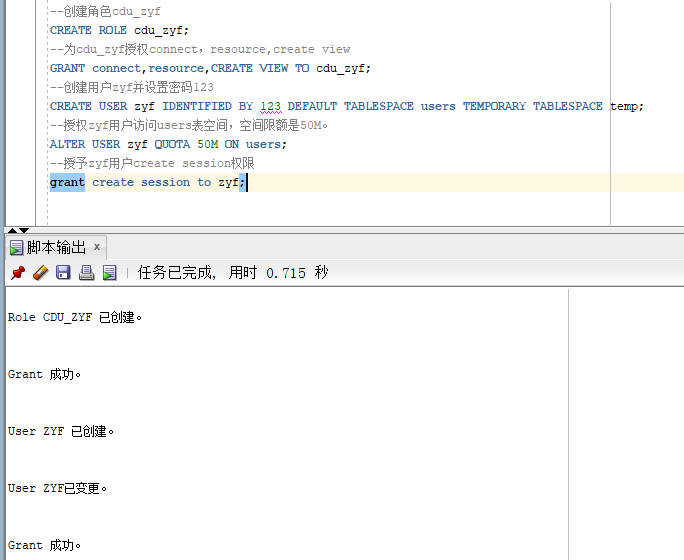
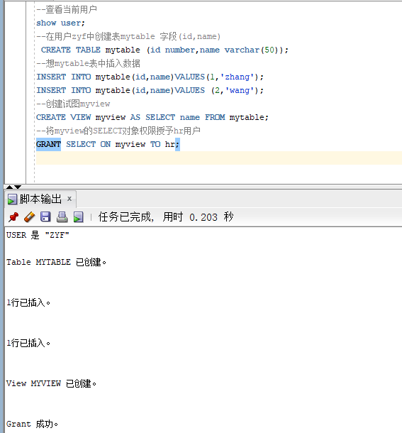
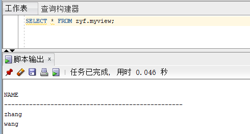
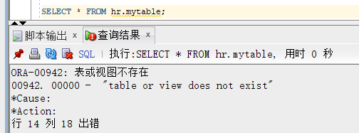
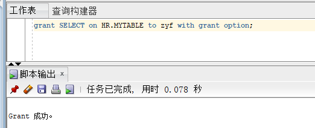

# test2

>**姓名**：张耀飞
>**实验目的**：掌握用户管理、角色管理、权根维护与分配的能力，掌握用户之间共享对象的操作技能。
>**实验内容**：
>
>Oracle有一个开发者角色resource，可以创建表、过程、触发器等对象，但是不能创建视图。本训练要求：
>
>- 在pdborcl插接式数据中创建一个新的本地角色con_res_view，该角色包含connect和resource角色，同时也包含CREATE VIEW权限，这样任何拥有con_res_view的用户就同时拥有这三种权限。
>
>- 创建角色之后，再创建用户new_user，给用户分配表空间，设置限额为50M，授予con_res_view角色。
>
>- 最后测试：用新用户new_user连接数据库、创建表，插入数据，创建视图，查询表和视图的数据。
>
>**role**: cdu_zyf
>
>**user**: zyf

### 1、第一步 创建role和user并授权

>   以system登录到pdborcl，创建角色cdu_zyf和用户zyf，并授权和分配空间：

```sql
--创建角色cdu_zyf
CREATE ROLE cdu_zyf;
--为cdu_zyf授权connect，resource,create view
GRANT connect,resource,CREATE VIEW TO cdu_zyf;
--创建用户zyf并设置密码123
CREATE USER zyf IDENTIFIED BY 123 DEFAULT TABLESPACE users TEMPORARY TABLESPACE temp;
--授权zyf用户访问users表空间，空间限额是50M。
ALTER USER zyf QUOTA 50M ON users;
--授予zyf用户create session权限
grant create session to zyf;
exit;--退出
```

​	执行结果：

`

### 2、第二步 创建表mytable和视图myview

>   新用户zyf连接到pdborcl，创建表mytable和视图myview，插入数据，最后将myview的SELECT对象权限授予hr用户。

```sql
--查看当前用户
show user;
--在用户zyf中创建表mytable 字段(id,name)
 CREATE TABLE mytable (id number,name varchar(50));
--想mytable表中插入数据
INSERT INTO mytable(id,name)VALUES(1,'zhang');
INSERT INTO mytable(id,name)VALUES (2,'wang');
--创建试图myview
CREATE VIEW myview AS SELECT name FROM mytable;
--将myview的SELECT对象权限授予hr用户
GRANT SELECT ON myview TO hr;
```

.

### 3、第三步

用户hr连接到pdborcl，查询zyf授予它的视图myview

```sql
SELECT * FROM zyf.myview;
```

 

### 4、测试共享

#### 4.1 未共享用户hr表时，用户zyf查看hr.mytable

 

#### 4.2 用户hr共享hr.mytable给zyf

 

共享过后用户zyf就可以访问hr的表了。

 

### 5、数据库和表空间占用分析

**查看数据库的使用情况**

```sql
SELECT tablespace_name,FILE_NAME,BYTES/1024/1024 MB,MAXBYTES/1024/1024 MAX_MB,autoextensible FROM dba_data_files  WHERE  tablespace_name='USERS';
```

users的表空间：

```sql
SELECT a.tablespace_name "表空间名",Total/1024/1024 "大小MB",
 free/1024/1024 "剩余MB",( total - free )/1024/1024 "使用MB",
 Round(( total - free )/ total,4)* 100 "使用率%"
 from (SELECT tablespace_name,Sum(bytes)free
        FROM   dba_free_space group  BY tablespace_name)a,
       (SELECT tablespace_name,Sum(bytes)total FROM dba_data_files
        group  BY tablespace_name)b
 where  a.tablespace_name = b.tablespace_name;
```

`s