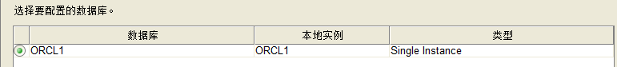
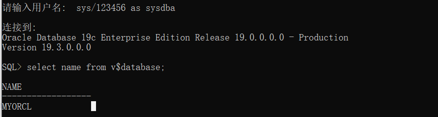
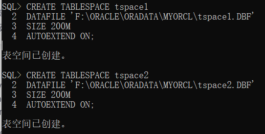
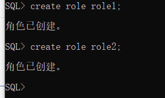
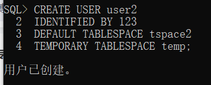
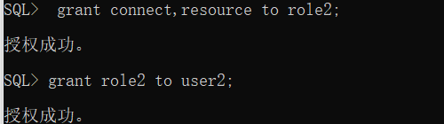
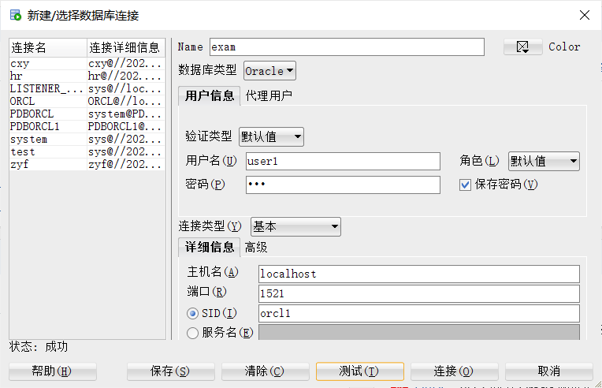
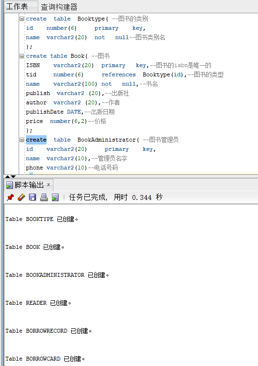
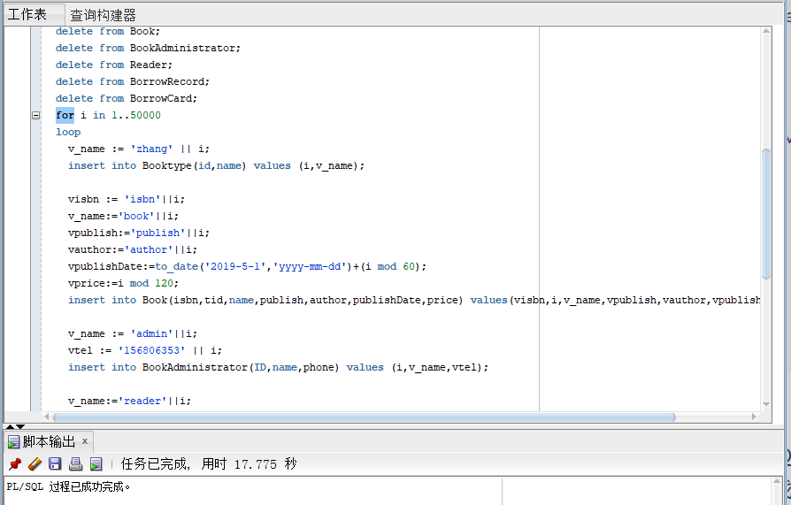

| 实验编号 |  姓名  |     学号     |   用户名    |
| :------: | :----: | :----------: | :---------: |
|  test6   | 张耀飞 | 201810414228 | zyf19990228 |

**项目名称：基于Oracle的图书管理信息系统数据库设计**

>   期末考核要求
>
>   -   自行设计一个信息系统的数据库项目，自拟`某项目`名称。
>   -   设计项目涉及的表及表空间使用方案。至少5张表和5万条数据，两个表空间。
>   -   设计权限及用户分配方案。至少两类角色，两个用户。
>   -   在数据库中建立一个程序包，在包中用PL/SQL语言设计一些存储过程和函数，实现比较复杂的业务逻辑，用模拟数据进行执行计划分析。
>   -   设计自动备份方案或则手工备份方案。

**内容**：

1、创建数据库

| name     | value |
| -------- | ----- |
| database | orcl1 |
| SID      | orcl1 |
| password | 123   |





2、创建表空间：

```sql
-- 创建表空间1
CREATE TABLESPACE tspace1
DATAFILE 'F:\ORACLE\ORADATA\ORCL1\tspace1.DBF'
SIZE 200M
AUTOEXTEND ON;
-- 创建表空间2
CREATE TABLESPACE tspace2
DATAFILE 'F:\ORACLE\ORADATA\ORCL1\tspace2.DBF'
SIZE 200M
AUTOEXTEND ON;
```



3、创建角色

```sql
create role role1;
create role role2;
```



4、给角色分配权限

```sql
grant connect,resource,dba,CREATE TABLE,CREATE VIEW to role1;
```


5、创建用户

```sql
-- 创建用户user1
CREATE USER user1
IDENTIFIED BY 123
DEFAULT TABLESPACE tspace1
TEMPORARY TABLESPACE temp;

-- 创建用户user2
CREATE USER user2
IDENTIFIED BY 123
DEFAULT TABLESPACE tspace2
TEMPORARY TABLESPACE temp;
```



6、赋role1给user1

```sql
grant role1 to user1;
```


```sql
-- 给role1分配权限，赋role2给user2
grant connect,resource to role2;
grant role2 to user2;
```



7、在SQL developer上连接数据库！



8、使用user1登录，创建所有的表

```sql
create  table  Booktype( --图书的类别 
id    number(6)     primary    key,
name  varchar2(20)  not   null--图书类别名
);
create table Book( --图书
ISBN    varchar(20)  primary   key,--图书的isbn是唯一的
tid     number(6)     references  Booktype(id),--图书的类型
name    varchar(100) not   null,--书名
publish  varchar(20),--出版社 
author  varchar(20),--作者
publishDate DATE,--出版日期
price  number(6)--价格
);
create  table  BookAdministrator( --图书管理员
id    varchar(20)     primary    key,
name  varchar(20),--管理员名字
phone varchar(20)--电话号码
);
create table Reader( --读者
id     varchar(20)     primary  key,
name   varchar(20)   not null,--读者姓名
sex    varchar(20),--读者性别
phone  varchar(20),--读者电话号码
photo  varchar(20)--读者头像
);
create table  BorrowRecord(--借阅记录
id number(6) primary  key,
quantity number(6) default 10,--最大可借数量
days number(6) default 30,--最大借阅天数
borrowdate date,--借书日期
dueDate date    --截止日期
);
create table BorrowCard(--借阅卡
id varchar2(20) primary key,
rid varchar2(20) references reader(id),--绑定读者id
brid     number(6) references BorrowRecord(id)--借阅数
);
```



9、向表中插入50000条数据：

```sql
declare
    v_name varchar(20);
    vtel varchar(20);
    visbn varchar(20);
    vpublish varchar(20);
    vauthor varchar(20);
    vpublishDate date;
    vprice number(6);
    vsex VARCHAR(20);
    vphoto varchar2(20);
    vquantity number(6);
    vdays number(6);
    vborrowdate date;
    vduedate date;
    vrid VARCHAR(20);
    vbrid NUMBER(6);
    
begin
  delete from Booktype;
  delete from Book;
  delete from BookAdministrator;
  delete from Reader;
  delete from BorrowRecord;
  delete from BorrowCard;
  for i in 1..50000
  loop
    v_name := 'zhang' || i;
    insert into Booktype(id,name) values (i,v_name);

	visbn := 'isbn'||i;
	v_name:='book'||i;
	vpublish:='publish'||i;
	vauthor:='author'||i;
	vpublishDate:=to_date('2019-5-1','yyyy-mm-dd')+(i mod 60); 
	vprice:=i mod 120;
    insert into Book(isbn,tid,name,publish,author,publishDate,price) values(visbn,i,v_name,vpublish,vauthor,vpublishDate,vprice);
    
    v_name := 'admin'||i;
    vtel := '156806353' || i;
    insert into BookAdministrator(ID,name,phone) values (i,v_name,vtel);
      
    v_name:='reader'||i;
    vsex := '男';
    vtel:='19960180' || i;
    vphoto:='photo'||i;
    insert into Reader(ID,name,sex,phone,photo) values (i,v_name,vsex,vtel,vphoto);
	
	vquantity:=i mod 10;
	vdays:=i mod 10;
	vborrowdate:=to_date('2019-1-1','yyyy-mm-dd')+(i mod 60); 
	vduedate:=to_date('2019-2-1','yyyy-mm-dd')+(i mod 60); 
	insert into BorrowRecord(id,quantity,days,borrowdate,duedate) values(i,vquantity,vdays,vborrowdate,vduedate);
	
    vrid :=  i;
    vbrid := i;
	insert into BorrowCard(id,rid,brid) values(i,vrid,vbrid);
    
    IF I MOD 1000 =0 THEN
      commit;
    END IF;
    end loop;
end;
/
```



10、在数据库中建立一个程序包，在包中用PL/SQL语言设计一些存储过程和函数，实现比较复杂的业务逻辑，用模拟数据进行执行计划分析。

```sql
create or replace PACKAGE MyPack IS
	-- 函数
  FUNCTION Get_BookAmount(T NUMBER) RETURN NUMBER;
  	-- 存储过程
  PROCEDURE Get_READERS(V_SEX VARCHAR);
END MyPack;
/

FUNCTION Get_BookAmount(T NUMBER) RETURN NUMBER
  AS
    N NUMBER(20,2);
    BEGIN
      SELECT COUNT(*) into N  FROM BOOK B;
      RETURN N;
    END;

PROCEDURE Get_READERS(V_SEX VARCHAR)
  AS
    LEFTSPACE VARCHAR(2000);
    begin
      for v in
      (SELECT ID,NAME,SEX,PHONE,PHOTO FROM READER WHERE V_SEX = SEX)
      LOOP
        DBMS_OUTPUT.PUT_LINE(NAME);
      END LOOP;
    END;
END MyPack;
/
```

11、设计自动备份方案或则手工备份方案。

手工备份数据库：就是将数据文件导出到磁盘，恢复的时候直接导入就行。

>   导出／导入
>   利用Export可将数据从数据库中提取出来，利用Import则可将提取出来的数据送回到Oracle数据库中去。 
>   简单导出数据（Export）和导入数据（Import） 
>   Oracle支持三种方式类型的输出： 
>   （１）、表方式（T方式），将指定表的数据导出。 
>   （２）、用户方式（U方式），将指定用户的所有对象及数据导出。 
>   （３）、全库方式（Full方式），瘵数据库中的所有对象导出。 
>   数据导入（Import）的过程是数据导出（Export）的逆过程，分别将数据文件导入数据库和将数据库数据导出到数据文件。 

自动备份：
>   sys用户以专用模式登录： $rman target sys/123@127.0.0.1/orcl1:dedicated

```sql
run{
configure retention policy to redundancy 1;
configure controlfile autobackup on;
configure controlfile autobackup format for device type disk to 'F:\Oracle\admin';
configure default device type to disk;
crosscheck backup;
crosscheck archivelog all;
allocate channel c1 device type disk;
allocate channel c2 device type disk;
allocate channel c3 device type disk;
backup incremental level 0 database format 'F:\Oracle\admin\level0_%d_%T_%U.bak';
report obsolete;
delete noprompt obsolete;
delete noprompt expired backup;
delete noprompt expired archivelog all;
release channel c1;
release channel c2;
release channel c3;
}
```

